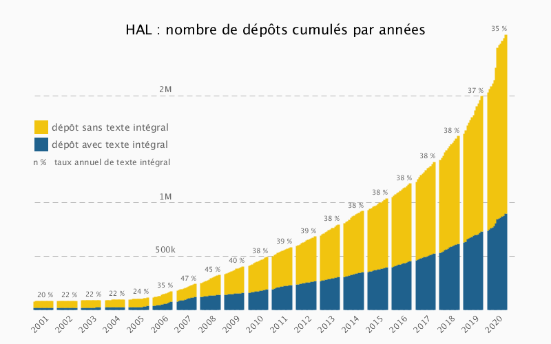
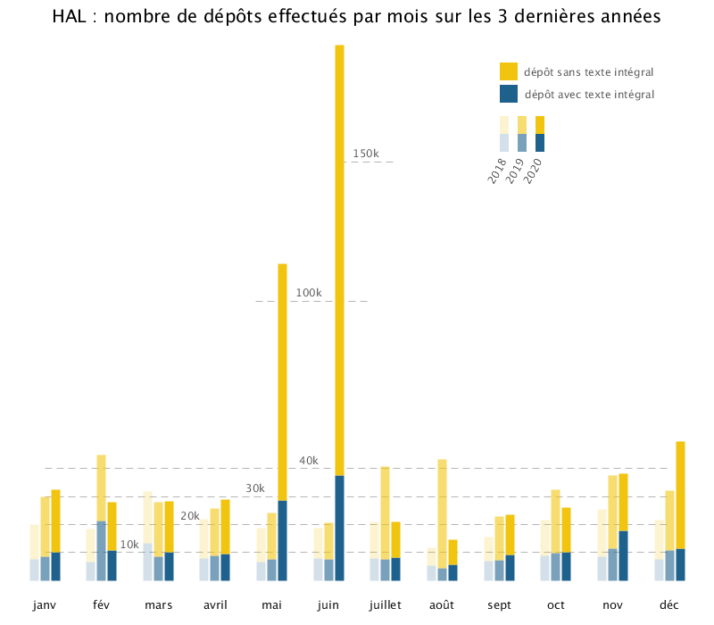

## Dépôts effectués par mois

mars 2018 : versement des thèses de Univ. Lorraine <br />
fev. 2019 : versement des rapports HCERES <br />
mai et juin 2020 : versement de prodinra et irstea <br />

<br /><br />
**le CRAC a-t-il impacté le nombre de dépôts en texte intégral ?**

Calcul de l'augmentation moyenne de dépots en plein texte par mois entre 2019 et 2020 : 

Mois pris en compte (sont exclus les mois avec des automates) : janv, mars, avril, juillet, aout, sept, oct, nov, dec

augmentation moyenne de ~ 19% par mois

aug. pour nov. 2020 : 57 % ! 


**récupérer les données**
```python 
import requests, json, pandas as pd

def reqHal(year, month):
	url= f"https://api.archives-ouvertes.fr/search/?rows=0&fq=submittedDateY_i:{year}&fq=submittedDateM_i:{month}&facet=true&facet.field=submitType_s"
	
	found = False
	while not found : 
		req = requests.get(url)
		try : 
			req = req.json()
			found = True
		except : 
			pass

	return {
	"notice": req["facet_counts"]["facet_fields"]["submitType_s"][1] + req["facet_counts"]["facet_fields"]["submitType_s"][5],
	"file" : req["facet_counts"]["facet_fields"]["submitType_s"][3]
	}

data = {}
for year in range (2018, 2021) : 
	for month in range(1, 13) : 
		result = reqHal(str(year), str(month))
		data[ f"{year}-{month}" ] = [result["notice"], result["file"]]
		print(f"{year}-{month}\t{result['notice']}\t{result['file']}")


df = pd.DataFrame.from_dict(data, orient='index')
df.index.name = "year-month"
df.to_csv("hal_depo_evolution.csv", header=[ "notice", "file"])
```
**représenter les données**
```processing
ArrayList<Month> months = new ArrayList<Month>();

Table data; 
IntList values = new IntList();
String[] monthname = {"janv", "fév", "mars", "avril", "mai", "juin", "juillet", "août", "sept", "oct", "nov", "déc"};
int margin, maxRectSize, txtLegendColor;


void setup() {
  size(800, 700);
  background(255);
  strokeCap(SQUARE);

  data = loadTable("../hal_depo_evolution.csv", "header");
  println("nb of rows", data.lastRowIndex());

  // parse data to arraylist 
  for (TableRow row : data.rows()) {
    // extract year and month
    String[] cut = row.getString(0).split("-");
    int itermonth = int(cut[1]);

    // find instances
    Boolean finded = false;
    for (Month m : months) {
      if (m.monthnb == itermonth) {
        m.update(int(cut[0]), int(row.getString(1)), int(row.getString(2)));
        finded = true;
        break;
      }
    }
    if (!finded) {
      months.add( new Month(int(cut[1]), int(row.getString(1)), int(row.getString(2))));
    }
  }

  // add month name and deduce max value
  for (Month m : months) {
    m.name = monthname[m.monthnb-1];
    for (int tempNotice : m.notice) {
      for (int tempFile : m.file) {
        values.append(tempNotice + tempFile);
      }
    }
  }

  println("nb of instances", months.size());
  print("min", values.min(), "max", values.max());
  println("\n\n");

  /*for (Month m : months) {
   println(m.name, m.notice);
   }*/
}

void draw() {
  noLoop();
  color fileColor = color(#1f618d);
  color noticeColor = color(#f1c40f);
  textAlign(CENTER, UP);
  textSize(12);
  maxRectSize = 600;
  txtLegendColor = 90;
  margin = 50;
  int nbOfYear = 3 ;


  addAxLegend(10000, "10k", width/5.5);
  addAxLegend(20000, "20k", width/3.75 );
  addAxLegend(30000, "30k", width/2.8 );
  addAxLegend(40000, "40k", width/2.31 );

  smallAxe(100000, "100k", width/2.31, 60);
  smallAxe(150000, "150k", width/1.95, 30);

  addGlobalLegend(fileColor, noticeColor);

  for (int i = 0; i < months.size(); i++) {
    Month m = months.get(i);

    float xpos = map(i, 0, months.size()-1, margin, width-margin);
    int distBetweenRect = 12;

    // month name
    textSize(13);
    fill(20);
    textAlign(CENTER, CENTER);
    text(m.name, xpos, height-margin/2);

    for (int year = 0; year < nbOfYear; year++) {

      float yfile = map(m.file.get(year), 0, values.max(), 0, maxRectSize); 
      float ynotice = map(m.notice.get(year), 0, values.max(), 0, maxRectSize);

      float changeXpos = map(year, 0, nbOfYear-1, -distBetweenRect, distBetweenRect);
      float alpha = map(year, 0, nbOfYear-1, 50, 255);

      strokeWeight(10);
      stroke(fileColor, alpha);
      line(xpos + changeXpos, height-margin, xpos+changeXpos, height-margin-yfile);

      stroke( noticeColor, alpha);
      line(xpos + changeXpos, height-margin-yfile, xpos+changeXpos, height-margin-yfile-ynotice);
    }
  }
  
  save("hal_depot_par_mois.png");
}

void smallAxe(int l, String legend, float xposText, float axSize) {
  float yaxe = map(l, 0, values.max(), 0, maxRectSize);
  yaxe = height - margin - yaxe;
  for (float xpos = xposText-axSize; xpos < xposText+ axSize; xpos +=13) {
    line(xpos, yaxe, xpos+8, yaxe);
  }
  fill(txtLegendColor);
  text(legend, xposText, yaxe-5);
}


void addAxLegend( int l, String legend, float xposText) {
  float yaxe = map(l, 0, values.max(), 0, maxRectSize);
  yaxe = height - margin - yaxe;
  strokeWeight(1);
  stroke(180);
  for (int xpos = margin; xpos < width-margin; xpos+=13) {
    line(xpos, yaxe, xpos+8, yaxe);
  }

  fill(txtLegendColor);
  text(legend, xposText, yaxe-5);
}


void addGlobalLegend(color fileColor, color noticeColor) {
  float xlegend = 3.5*width/5.0;
  float ylegend = height/10;
  noStroke();

  fill(noticeColor);
  rect(xlegend, ylegend, 20, 20);
  fill(txtLegendColor);
  text("dépôt sans texte intégral", xlegend + 100, ylegend+15);

  fill(fileColor);
  rect(xlegend, ylegend+25, 20, 20);
  fill(txtLegendColor);
  text("dépôt avec texte intégral", xlegend + 100, ylegend+40);

  ylegend += 130;
  xlegend += 0 ; 
  String[] year = {"2018", "2019", "2020"};
  for (int i = 0; i < year.length; i ++) {
    float tempx = map(i, 0, year.length-1, 0, 40);
    float tempalpha = map(i, 0, year.length-1, 50, 255);

    fill(fileColor, tempalpha);
    rect(xlegend+tempx, ylegend-50, 10, 20);

    fill(noticeColor, tempalpha);
    rect(xlegend+tempx, ylegend-70, 10, 20);

    pushMatrix();
    translate(xlegend+tempx, ylegend-5);
    rotate(-PI/3.0);
    fill(txtLegendColor);
    text(year[i], 0, 0 );
    popMatrix();
  }
  
  textSize(20);
  fill(0);
  text("HAL : nombre de dépôts effectués par mois sur les 3 dernières années", width/2, margin/2);
}


// a class for Month
class Month {
  String name ; 
  int monthnb; 
  // value for years are added into IntList (implicit index)
  IntList notice = new IntList();
  IntList file = new IntList();
  Month(int _monthnb, int _notice, int _file) {
    monthnb = _monthnb;
    notice.append(_notice);
    file.append(_file);
  }


  void update(int y, int _notice, int _file) {
    notice.append(_notice);
    file.append(_file);
  }
}
```


## Dépôts cumulés par années

**récupérer les données**
```python
import requests, json, pandas as pd

def reqHal(year, month):
	url=f"https://api.archives-ouvertes.fr/search/?&rows=0&fq=submittedDate_tdate:[1500-01-01T00:00:00Z%20TO%20{year}-{month}-01T00:00:00Z]&facet=true&facet.field=submitType_s"
	
	found = False
	while not found : 
		req = requests.get(url)
		try : 
			req = req.json()
			found = True
		except : 
			pass

	return {
	"notice": req["facet_counts"]["facet_fields"]["submitType_s"][1] + req["facet_counts"]["facet_fields"]["submitType_s"][5],
	"file" : req["facet_counts"]["facet_fields"]["submitType_s"][3]
	}

data = {}
for year in range(2001, 2021) : 
	for month in range(1,13) : 
		result = reqHal(str(year), str(month))
		data[ f"{year}-{month}" ] = [result["notice"], result["file"]]
		print(f"{year}-{month}\t{result['notice']}\t{result['file']}")


df = pd.DataFrame.from_dict(data, orient='index')
df.index.name = "year-month"
df.to_csv("evol_depot_cumule.csv", header=[ "notice", "file"])
```
**représenter les données**
```processing
ArrayList<Month> months = new ArrayList<Month>();

String[] monthname = {"janv", "fév", "mars", "avril", "mai", "juin", "juillet", "août", "sept", "oct", "nov", "déc"};
IntList values = new IntList();
int maxRectSize, margin, txtLegendColor;

void setup() {
  size(800, 500);
  background(250);

  Table data;
  data = loadTable("evol_depot_cumule.csv", "header");
  println("csv last row index", data.lastRowIndex());

  for (TableRow row : data.rows()) {
    String[] cut = row.getString(0).split("-");

    months.add(new Month(int(cut[0]), int(cut[1]), row.getInt(1), row.getInt(2)));
    values.append(row.getInt(1)+ row.getInt(2));
  }

  println("array list", months.size());

  // add month name 
  for (Month m : months)m.name = monthname[m.monthnb-1];

  // calc rapport file / notice for year
  FloatList getVals = new FloatList() ; 
  for (int i = 0; i < months.size(); i++) {
    Month m = months.get(i);
    float ctemp = (float)m.file/(m.notice+m.file)*100 ;

    if ( ! m.name.equals("déc")) {   
      getVals.append( ctemp);
    }
    if ( m.name.equals("déc")) {
      getVals.append( ctemp);

      float temp = getVals.sum() / getVals.size();
      temp = round(temp);
      m.rapport = str(int(temp))+" %";
      getVals.clear();
      println(m.year, m.rapport);
    }
  }


  //calculer les positions de x
  margin = 50;
  int yearSpace = 150;

  int nbOfYears = months.size()/12 ;
  println(nbOfYears);
  FloatList xpos = new FloatList() ; 
  float increm = (float)(width-margin-yearSpace)/(months.size()+nbOfYears);

  for ( int i = 0; i < months.size(); i++) {
    Month me = months.get(i);
    if (i == 0) {
      me.x = margin ;
      xpos.append(me.x);
      continue;
    }

    if (me.monthnb == 1) {
      me.x = xpos.get(i-1) + increm + yearSpace/nbOfYears ;
      xpos.append(me.x);
    }

    if (me.monthnb != 1) {
      me.x = xpos.get(i-1) + increm ;
      xpos.append(me.x);
    }
  }
}

void draw() {
  noLoop();
  strokeCap(SQUARE);
  textAlign(CENTER);
  txtLegendColor = 100;
  color fileColor = color(#1f618d);
  color noticeColor = color(#f1c40f);
  maxRectSize = 400;  


  addGlobalLegend(fileColor, noticeColor);
  addAxLegend(500000, "500k", width*0.3);
  addAxLegend(1000000, "1M", width*0.3);
  addAxLegend(2000000, "2M", width*0.3);


  strokeWeight(4);
  // pour tous les mois
  for ( int i = 0; i < months.size(); i++) {
    Month me = months.get(i);

    //si premier mois de l'année ajouter l'année
    if ( me.monthnb == 1) addYearLabel(str(me.year), me.x+ 10);    


    float calcy1 = map(me.file, 0, values.max(), 0, maxRectSize);
    stroke(fileColor);
    line(me.x, height-margin, me.x, height-margin-calcy1 );

    float calcy2 = map(me.notice, 0, values.max(), 0, maxRectSize);
    stroke(noticeColor);
    line(me.x, height-margin-calcy1, me.x, height-margin-calcy1-calcy2 );

    // ajouter le rapport file / notice+file
    if ( me.monthnb == 12)addRapportLabel(me.rapport, me.x, height-margin-calcy1-calcy2);
  }
  
  save("hal_evol_depo.png");
}

void addRapportLabel(String s, float x, float y ) {
  textSize(10);
  text(s, x-10, y-5);
}
void addGlobalLegend(color fileColor, color noticeColor) {

  float xlegend = margin;
  float ylegend = height*0.35;
  noStroke();
  textSize(14);

  fill(noticeColor);
  rect(xlegend, ylegend, 20, 20);
  fill(txtLegendColor);
  text("dépôt sans texte intégral", xlegend + 110, ylegend+15);

  fill(fileColor);
  rect(xlegend, ylegend+25, 20, 20);
  fill(txtLegendColor);
  text("dépôt avec texte intégral", xlegend + 110, ylegend+40);

  textSize(20);
  fill(0);
  text("HAL : nombre de dépôts cumulés par années", width/2, margin);
}

void addYearLabel(String s, float x) {
  pushMatrix();
  translate(x, height-margin/2);
  rotate(-PI/4);
  textSize(12);
  text(s, 0, 0 );
  popMatrix();
}

void addAxLegend( int l, String legend, float xposText) {
  float yaxe = map(l, 0, values.max(), 0, maxRectSize);
  yaxe = height - margin - yaxe;

  strokeWeight(1);
  stroke(180);

  for (int xpos = margin; xpos < width-margin; xpos+=13) {
    line(xpos, yaxe, xpos+8, yaxe);
  }

  fill(txtLegendColor);
  textSize(12);
  text(legend, xposText, yaxe-5);
}


// a class for Month
class Month {
  String name ; 
  int year, monthnb; 
  // value for years are added into IntList (implicit index)
  int notice, file;
  String rapport ; 
  float x;
  Month(int _year, int _monthnb, int _notice, int _file) {

    year = _year;
    monthnb = _monthnb;
    notice = _notice ; 
    file = _file ;
  }
}
```

